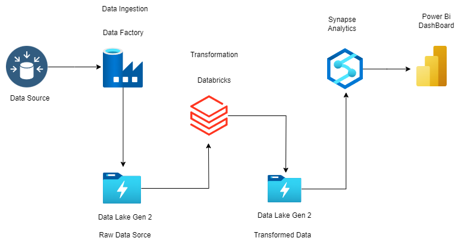
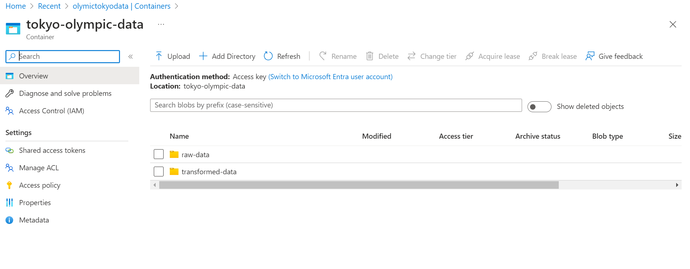
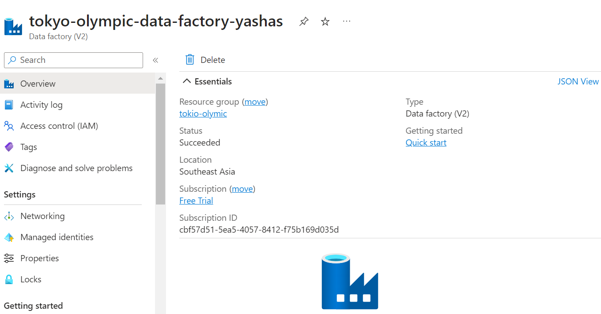
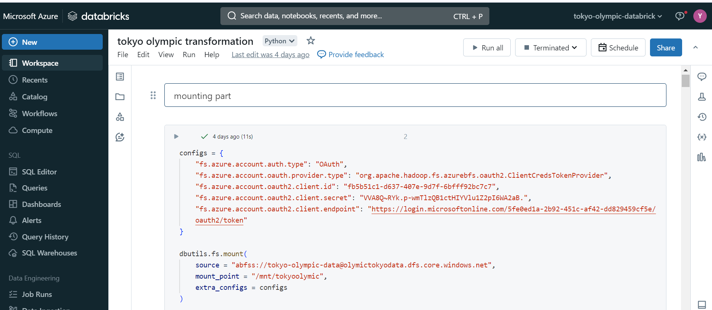
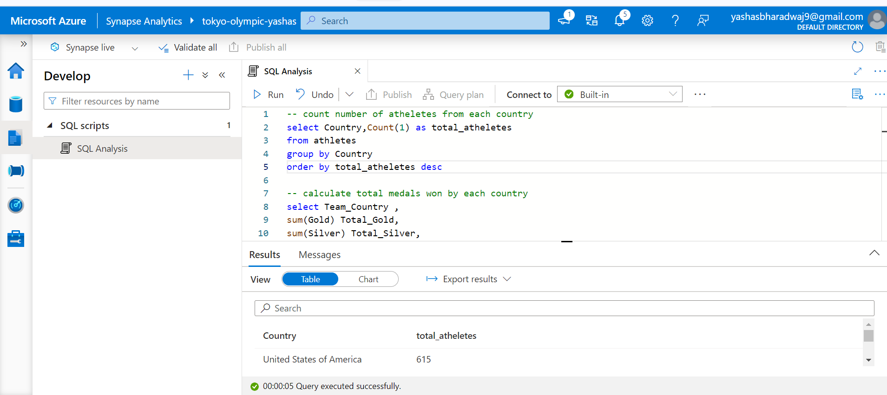

# Azure ETL Data Pipeline on Olympic Dataset

This project implements an Azure ETL data pipeline for analyzing the 2021 Tokyo Olympics dataset. The pipeline includes data ingestion, storage, transformation, and analysis using various Azure services such as Data Lake Gen2, Data Factory, Databricks, and Synapse Analytics.

## Data Source

- **Dataset**: [2021 Tokyo Olympics on Kaggle](https://www.kaggle.com/datasets/arjunprasadsarkhel/2021-olympics-in-tokyo)
- **Details**: The dataset contains information on over 11,000 athletes, 47 disciplines, and 743 teams participating in the 2021 Tokyo Olympics. It includes details on athletes, coaches, teams, and entries by gender.

## Data Lake Gen2

1. **Create Storage Account**
2. **Create Containers**: 
    - Raw data
    - Transformed data

## Data Factory

1. **Create Data Factory**
2. **Copy Data Activity**:
    - Source: HTTP (select CSV from GitHub, click on raw data, use the raw file URL)
    - Sink: Azure Data Lake Gen2 (browse path to raw data)
3. **Validate and Debug**: Ensure data is stored in the raw data folder in the storage container.

## Databricks

1. **Launch Notebook**
2. **Mount Data from Azure Data Lake Gen2**:
    - Go to app registration, copy client ID and tenant ID.
    - Create client secrets from certificates and secrets.
    - Paste configs dictionary code in notebook.
    - Validate mounting.
3. **Assign IAM Role**:
    - Go to storage account, IAM, add role assignment (Storage Blob Data Contributor).
    - Add the app name from app registrations.
4. **Read and Transform Data**:
    - Use Spark to read, transform, and load data to the transformed_data folder.
    - Verify data in both notebook and storage container.

## Synapse Analytics

1. **Create Synapse Analytics Workspace**:
    - Follow the UI to launch Synapse Studio.
2. **Import Data**:
    - Go to data, click on add, choose data lake.
    - Import all CSV files from the transformed data folder.
3. **SQL-Based Analysis**: Derive insights using SQL in Synapse Analytics.

## Conclusion

This guided project by Darshil Parmar provides a comprehensive understanding of the Azure platform and data engineering processes.

### Sources

- [Youtube video part1 ](https://www.youtube.com/watch?v=IaA9YNlg5hM)
- [Youtube video part2 ](https://www.youtube.com/watch?v=nW0ffUW2vw4)

