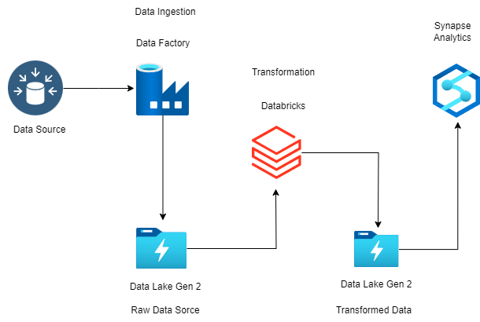

#Azure ETL Data Pipeline on Olympic Dataset 

 

Dataset :- https://www.kaggle.com/datasets/arjunprasadsarkhel/2021-olympics-in-tokyo  

Details
This contains the details of over 11,000 athletes, with 47 disciplines, along with 743 Teams taking part in the 2021(2020) Tokyo Olympics.

This dataset contains the details of the Athletes, Coaches, Teams participating as well as the Entries by gender. It contains their names, countries represented, discipline, gender of competitors, name of the coaches. 

